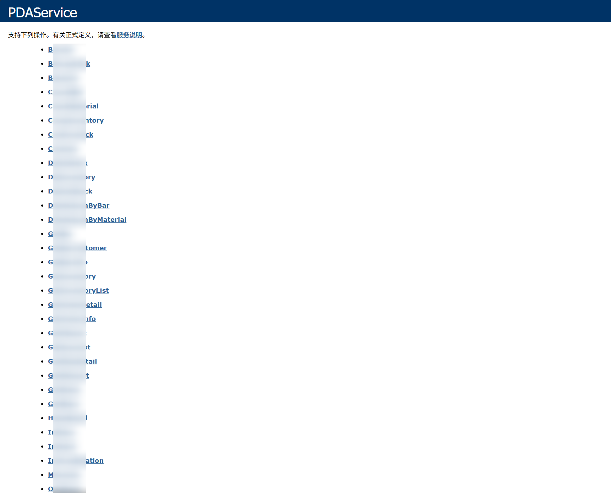

# WSDL注入检查工具

## 介绍
对WSDL接口自动进行SQL注入测试，可以自动爬取接口信息，并填充信息进行SQL注入测试。SQL注入检测依赖sqlmapApi工具。
输入以下页面的网站，将自动爬取测试。~~代码写的有点潦草，见笑了~~~

## 准备环境
使用的python3环境
```sh
# 下载sqlmap项目
git clone https://github.com/sqlmapproject/sqlmap.git

cd sqlmap

# 启动sqlmapApi,默认监听本机8775端口
python3 sqlmapapi.py -s
```
## 使用方法

### 快速开始
```shell
# 单个扫描，使用3倍线程，使用代理
python InjectWSDL.py -t http://scanme.sh -T 3 --proxy http://127.0.0.1:7890
```
### 全部参数
```shell
optional arguments:
  -h, --help            show this help message and exit
  -t TARGET, --target TARGET
                        输入URL
  -tf TARGET_FILE, --target_file TARGET_FILE
                        输入文件目录,URL一行一个
  --is_first_stop IS_FIRST_STOP
                        当前URL发现漏洞后立即停止扫描,输入True,False.默认:True
  -api SQLMAP_API, --sqlmap_api SQLMAP_API
                        输入sqlmapApi地址,默认http://127.0.0.1:8775
  -T THREAD, --thread THREAD
                        同时进行sql注入的数据包
  -p PROXY, --proxy PROXY
                        代理地址,http://127.0.0.1:7890
  -log LOGLEVEL, --loglevel LOGLEVEL
                        日志显示等级info,error,debug
  -v, --version         show program's version number and exit
```

## Thanks
- [sqlmap](https://github.com/sqlmapproject/sqlmap.git)